<div align="center">

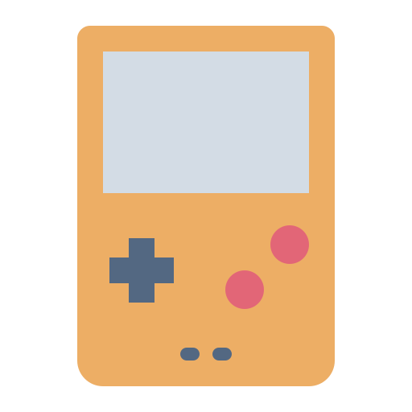

# RetroX

### Self-hosted retro gaming, right in your browser.

[](https://github.com/polius/RetroX/releases)
[](https://hub.docker.com/r/poliuscorp/retrox)
[](LICENSE)

**Simple** · **Lightweight** · **Self-hosted** · **Open source**

</div>

---

## Screenshots

<table>
<tr>
<td width="50%" align="center">

<br/><sub><b>Library</b> — your collection at a glance</sub>
</td>
<td width="50%" align="center">
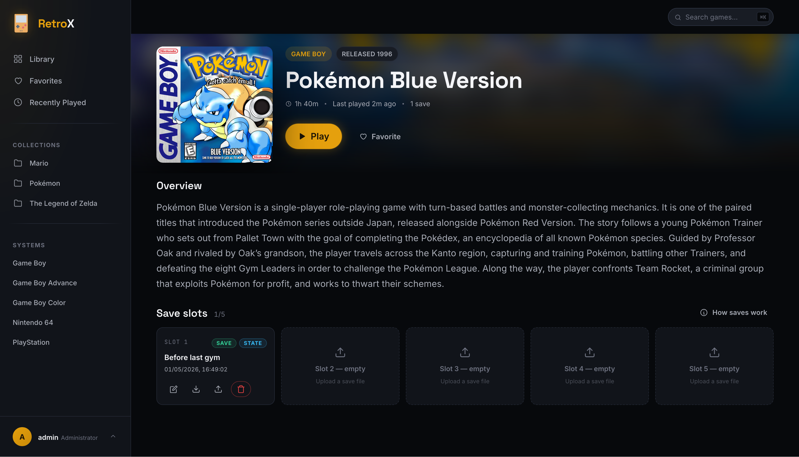
<br/><sub><b>Game details</b> — covers, descriptions, playtime</sub>
</td>
</tr>
<tr>
<td width="50%" align="center">
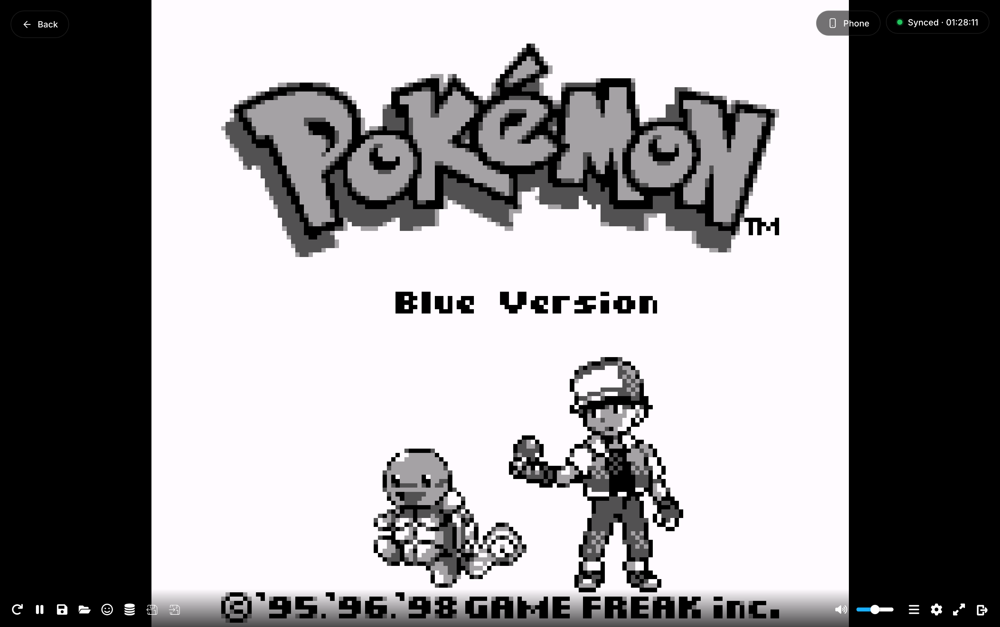
<br/><sub><b>Playing a game</b> — straight in the browser</sub>
</td>
<td width="50%" align="center">
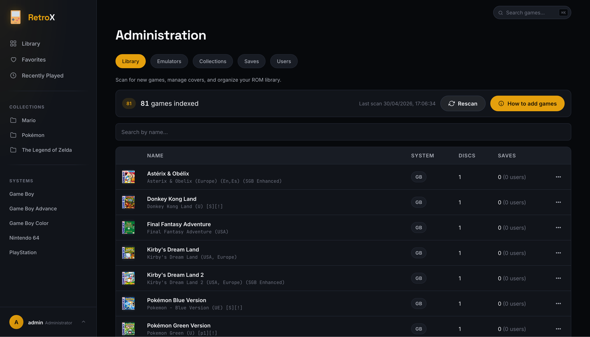
<br/><sub><b>Admin panel</b> — full control over your library</sub>
</td>
</tr>
</table>

## Quick Start

RetroX runs in a Docker container. Just one command to get started:

```bash
docker run -d \
  --name retrox \
  --restart unless-stopped \
  -p 8080:8080 \
  -v $(pwd)/data:/data \
  poliuscorp/retrox
```

Open **http://localhost:8080** and sign in with `admin` / `admin`.

> A `data/` folder will be created in your current directory to hold your games, saves, and database. If the folder already exists (for example, from a previous installation), RetroX will reuse it — your existing data is preserved.

<details>
<summary><b>Prefer Docker Compose?</b></summary>

```yaml
services:
  retrox:
    image: poliuscorp/retrox
    container_name: retrox
    restart: unless-stopped
    ports:
      - "8080:8080"
    volumes:
      - ./data:/data
```

```bash
docker compose up -d
```
</details>

## Features

| | |
|---|---|
| **Lightweight** | <150 MB image, minimal CPU and RAM. Runs on a Pi, NAS, or cheap VPS. |
| **Cross-device sync** | Saves follow you across devices — phone, laptop, and TV — automatically. |
| **Full controller support** | Control the entire app with a gamepad — menus, search, saves, and more. |
| **Local multi-player** | Two-player support on N64 and PSX — connect a second gamepad and start playing. |
| **Phone as gamepad** | While playing a game, scan a QR with your phone and use it as a wireless gamepad. |
| **Fast-forward & rewind** | Skip the grind or undo a mistake on the fly — available on supported cores. |
| **Multi-disc games** | Full support for multi-disc games such as PSX. |
| **Save states** | 5 slots per game. Export backups, import from other emulators. |
| **Multi-user accounts** | Per-user saves and favorites. Optional two-factor authentication. |
| **QR code login** | Sign in on a TV by scanning a code with your phone. |
| **Collections** | Organize games into custom groups like *Pokémon* or *Mario*. |
| **Playtime tracking** | Tracked per game and per save slot. |
| **Game metadata** | Covers, descriptions, release dates — editable from the admin panel. |
| **Responsive UI** | Looks right on phones, laptops, and TVs. |
| **Admin panel** | Manage users, rescan the library, configure emulators, monitor saves. |

## Cross-device sync

Saves don't live on one device. RetroX **continuously mirrors** the cartridge's save memory to the server while you play — every few seconds, in the background, with no input from you. Close the tab, switch laptops, lose power: your progress is safe and you'll pick up exactly where you left off on any device.

A pill in the top-right corner of the player surfaces the current state. Click it for the full story.

<table>
<tr>
<td width="50%" align="center">
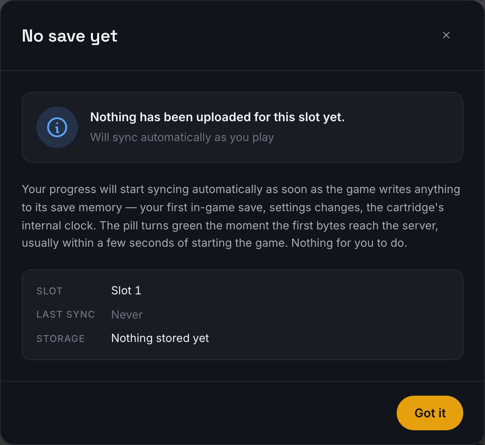
<br/><sub><b>No save yet</b> — fresh slot, nothing uploaded. The pill turns green within seconds of starting the game.</sub>
</td>
<td width="50%" align="center">
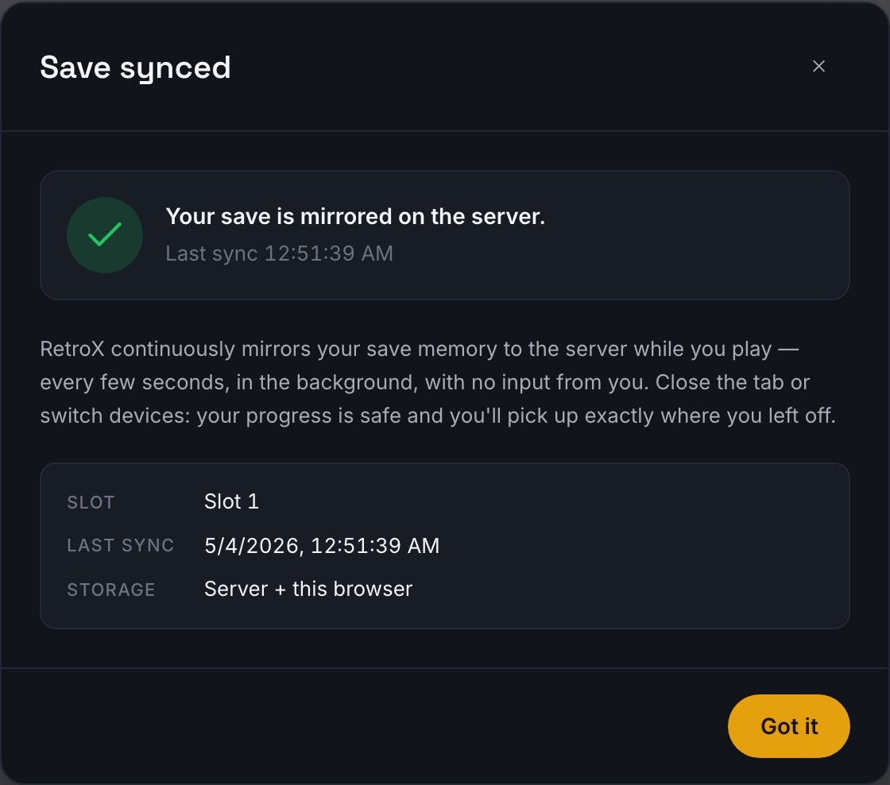
<br/><sub><b>Synced</b> — your save is mirrored on the server. Continuous, automatic.</sub>
</td>
</tr>
<tr>
<td width="50%" align="center">
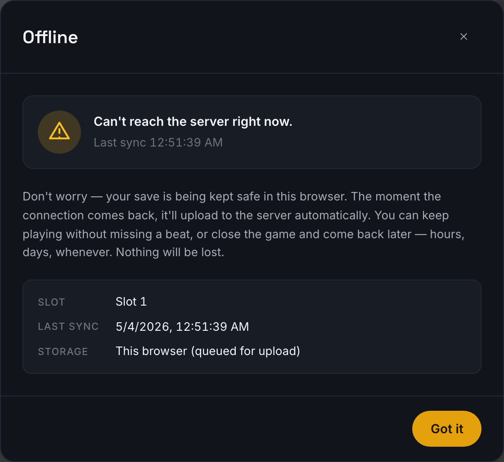
<br/><sub><b>Offline</b> — server unreachable. Saves are kept locally and retried indefinitely until the connection returns.</sub>
</td>
<td width="50%" align="center">
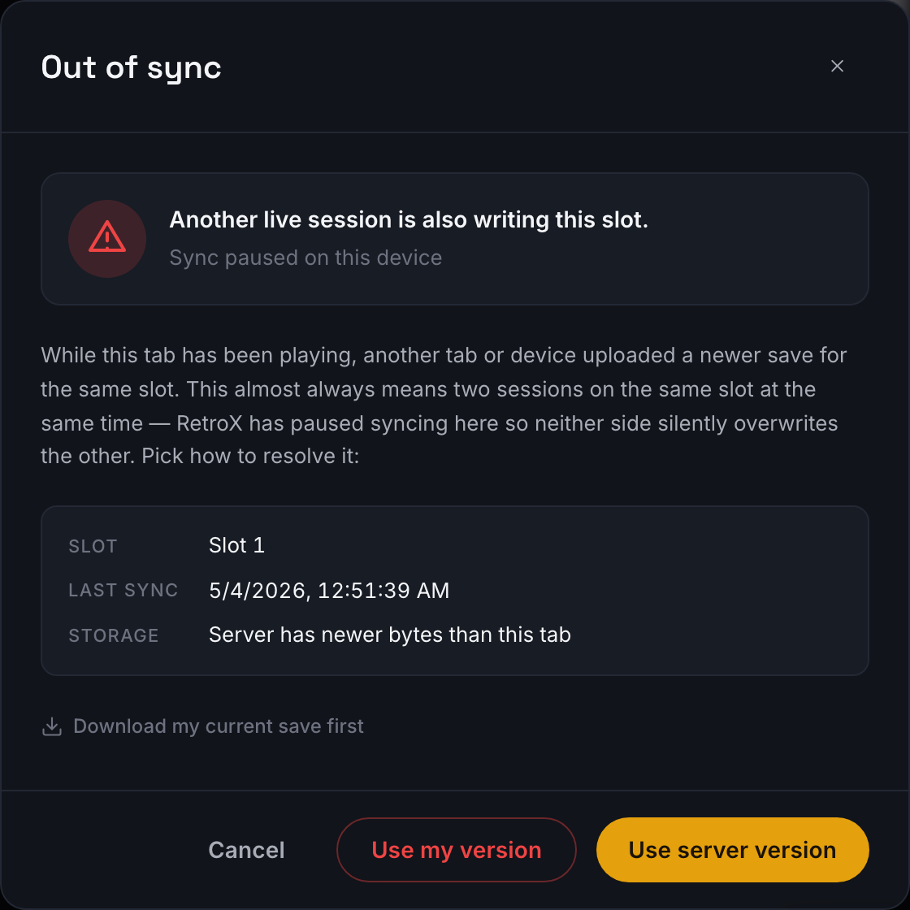
<br/><sub><b>Out of sync</b> — two live sessions writing the same slot at once. You pick which version wins.</sub>
</td>
</tr>
</table>

## Phone as gamepad

Don't have a gamepad on the device you're playing on? Use your phone instead. RetroX turns any phone into a wireless gamepad for the game currently running on your laptop or TV — **no app to install**, no Bluetooth pairing. Just scan a QR code and you're good to go.

How to use it:

1. Play any game and click the **Phone** pill in the top-right corner.
2. A dialog appears with a QR and a 6-character pairing code.
3. **On your phone**, scan the QR code or enter the code manually.
4. Done! You can now use your phone as a gamepad.

<table>
<tr>
<td width="50%" align="center">
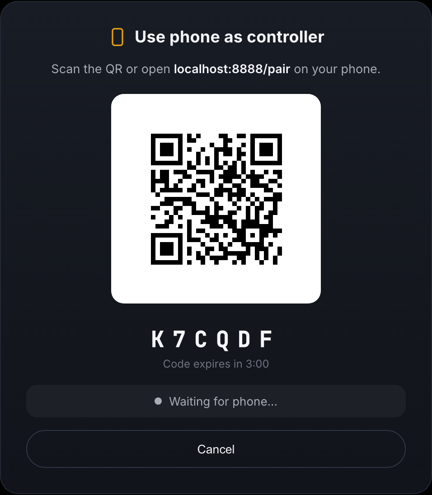
<br/><sub><b>Scan the QR</b> — or type the 6-character code on the phone. The code expires in 3 minutes if no phone joins.</sub>
</td>
<td width="50%" align="center">
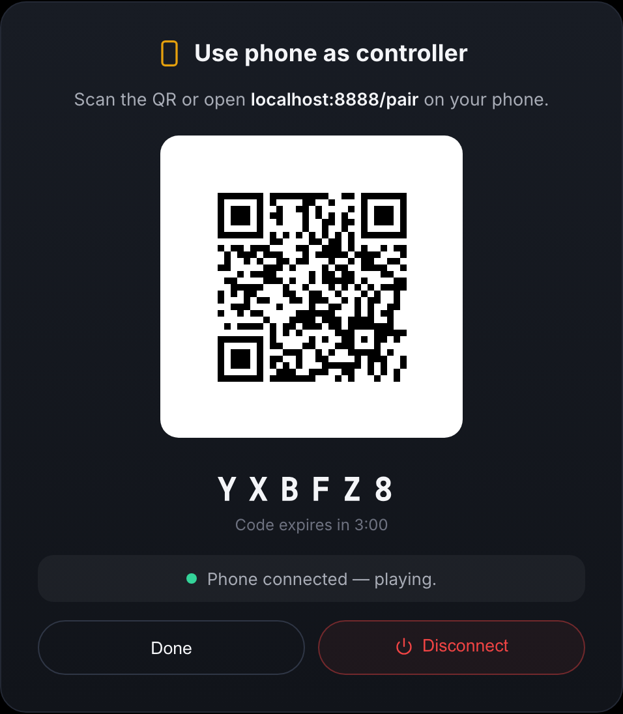
<br/><sub><b>Connected</b> — click Done to keep playing with the dialog hidden, or Disconnect to end the session.</sub>
</td>
</tr>
<tr>
<td width="50%" align="center">
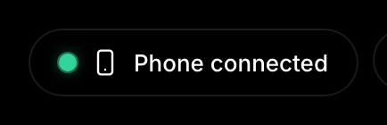
<br/><sub><b>The Phone pill</b> — green dot means a phone is connected. Click any time to manage the pairing.</sub>
</td>
<td width="50%" align="center">
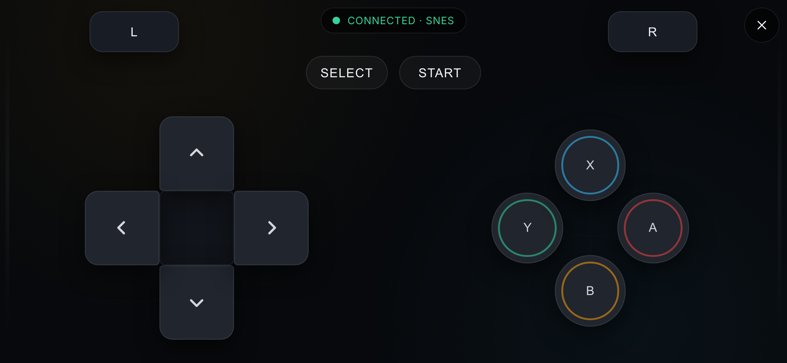
<br/><sub><b>The controller</b> — D-pad, face buttons, shoulders, and Select/Start. Layout adapts to the system you're playing.</sub>
</td>
</tr>
</table>

## Adding Games

Drop ROMs into `data/roms/`, organized by system folder:

```
data/roms/gb/tetris.gb
data/roms/gba/pokemon-emerald.gba
data/roms/n64/mario-kart.z64
```

Then click **Admin → Library → Rescan**.

### Multi-disc games

Use one folder per game. Discs are loaded in filename order:

```
data/roms/psx/Final Fantasy IX/
├── disc1.cue
├── disc1.bin
├── disc2.cue
├── disc2.bin
├── disc3.cue
├── disc3.bin
├── disc4.cue
└── disc4.bin
```

## Supported Systems

| System | Folder | Extensions |
|--------|--------|-----------|
| Game Boy | `gb` | `.gb` |
| Game Boy Color | `gbc` | `.gbc` |
| Game Boy Advance | `gba` | `.gba` |
| Nintendo 64 | `n64` | `.n64` `.z64` `.v64` |
| PlayStation | `psx` | `.bin` `.cue` `.iso` `.img` `.chd` `.pbp` `.ecm` |

Any ROM file can also be gzipped with a `.gz` extension (e.g. `mario-kart.z64.gz`) — RetroX decompresses on the fly.

### Adding a new system

RetroX uses [EmulatorJS](https://github.com/EmulatorJS/EmulatorJS/releases) cores. To add support for a new system (e.g., NES, Master System, PC Engine):

1. Download the core's `.data` file from EmulatorJS releases. The filename should follow the pattern `<corename>-wasm.data` (e.g., `fceumm-wasm.data` for NES, `genesis_plus_gx-wasm.data` for Mega Drive).
2. Drop the file into `data/cores/`.
3. Open **Admin → Emulators → Add Emulator** and register the system: choose the core file, set the system folder name (e.g., `nes`), and list the file extensions (e.g., `.nes`, `.zip`).
4. Drop ROMs into `data/roms/<system>/` and click **Library → Rescan**.

Legacy variants (`-legacy-wasm.data`) are used as a fallback for older devices.

## Controls

The whole app is gamepad-first — browse the library, search, manage saves, and launch ROMs without ever needing a keyboard or mouse.

**App navigation** (gamepad)

| Button | Action |
|--------|--------|
| D-pad / Stick | Navigate |
| A / ✕ | Select |
| B / ○ | Back |
| X / □ | Search |
| Y / △ | Favorite |
| L1 / R1 | Cycle filters |
| Start | Play |

**In-game** — keyboard bindings are rebindable per-user in **Profile → Controls** and sync across devices. Fast forward and rewind can be turned on or off for each emulator in **Admin → Emulators**. No gamepad? While playing, you can also use your [phone as a gamepad](#phone-as-gamepad).

| Action | Gamepad | Keyboard |
|---|---|---|
| D-pad Up | D-pad ↑ | Up |
| D-pad Down | D-pad ↓ | Down |
| D-pad Left | D-pad ← | Left |
| D-pad Right | D-pad → | Right |
| A | A / ✕ | X |
| B | B / ○ | Z |
| X | X / □ | S |
| Y | Y / △ | A |
| L1 | L1 | Q |
| R1 | R1 | E |
| Start | Start | Enter |
| Select | Select | V |
| Fast forward\* | R2 | Space |
| Rewind\* | L2 | Backspace |
| Save state | Select + L1 | F2 |
| Load state | Select + R1 | F4 |
| Exit game | Select + Start | Esc |

\* Only for supported emulators.

## Covers & Metadata

Edit metadata in **AdSmin → Library → Edit game**.

A great source of cover art and game info: [LaunchBox Games Database](https://gamesdb.launchbox-app.com/).

## Updating RetroX

Pull the latest image and recreate the container:

```bash
docker pull poliuscorp/retrox
docker stop retrox && docker rm retrox
docker run -d \
  --name retrox \
  --restart unless-stopped \
  -p 8080:8080 \
  -v $(pwd)/data:/data \
  poliuscorp/retrox
```

Your `data/` folder is untouched — games, saves, and database carry over.

<details>
<summary><b>Using Docker Compose?</b></summary>

```bash
docker compose pull
docker compose up -d
```

</details>

## Acknowledgements

Powered by [EmulatorJS](https://github.com/EmulatorJS/EmulatorJS).

Ships with demo ROMs [*Tobu Tobu Girl*](https://tangramgames.dk/tobutobugirl/) and [*Tobu Tobu Girl Deluxe*](https://tangramgames.dk/tobutobugirldx/) by [Tangram Games](https://tangramgames.dk/) — a delightful open-source platformer and its enhanced color edition, both released under MIT (code) / CC-BY (assets).

## Legal

You are responsible for ensuring that you have the legal right to use any ROMs in your library.

## License

[GPLv3](LICENSE)
